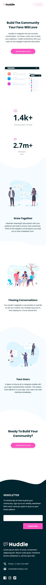

# Frontend Mentor - Huddle landing page with curved sections solution

Olá, seja bem vindo a mais uma resolução de desafio. Desta vez, resolvi o [Huddle landing page with curved sections](https://www.frontendmentor.io/challenges/article-preview-component-dYBN_pYFT). Sugestões e dicas são bem-vindas!

## Contéudo

- [Frontend Mentor - Huddle landing page with curved sections solution](#frontend-mentor---huddle-landing-page-with-curved-sections-solution)
  - [Contéudo](#contéudo)
  - [Desafio](#desafio)
  - [Screenshot da minha solução:](#screenshot-da-minha-solução)
  - [Processo de desenvolvimento:](#processo-de-desenvolvimento)
    - [Ferramentas](#ferramentas)
    - [O que eu aprendi:](#o-que-eu-aprendi)

<a name="desafio">
## Desafio
</a>
Foi proposto recriar o seguinte site, fazendo o mais semelhante possível, a partir de um guia de estilo fornecido.

<a name="screenshot">
## Screenshot da minha solução:
</a>

<a name="meu-processo">
## Processo de desenvolvimento:
</a>

<a name="ferramentas">
### Ferramentas
</a>

- [Adobe Color](https://color.adobe.com/pt/create/color-wheel) - Paleta de cores
- [Atom](https://atom.io/) - Editor de texto
- [FireFox](https://www.mozilla.org/pt-BR/firefox/new/) - Navegador utilizado para visualização e desenvolvimento do site
- [Google Fonts](https://fonts.google.com)
- Arquitetura BEM
- commit-msg-linter
- CSS3
- HTML5
- Mobile-first

<a name="aprendizado">
### O que eu aprendi:
</a>

- Arquitetura BEM
- Padronização do CSS
- Posicionamento dos elementos
- uso de background
- uso de variaveis css
- padronização de commits do git

