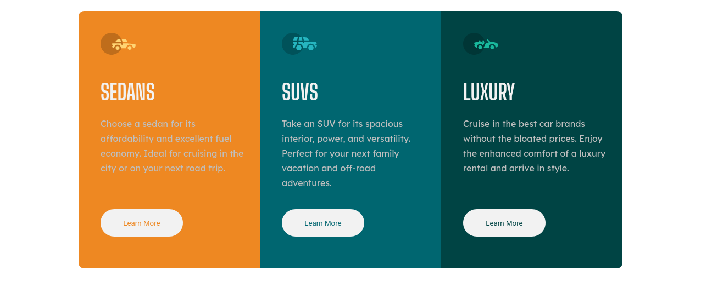
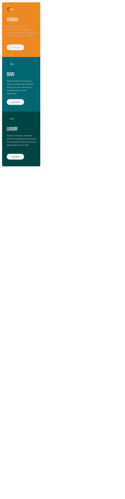

# Frontend Mentor - 3-column preview card component

Olá, seja bem vindo a mais uma resolução de desafio. Desta vez, resolvi o [3-column preview card component challenge on Frontend Mentor](https://www.frontendmentor.io/challenges/3column-preview-card-component-pH92eAR2-). Sugestões e dicas são bem-vindas!

## Contéudo

- [Desafio](#desafio)
    - [Screenshot](#screenshot)
- [Meu processo](#meu-processo)
    - [Ferramentas](#ferramentas)
    - [O que eu aprendi](#aprendizado)

<a name="desafio">
## Desafio
</a>
Foi proposto recriar o seguinte site, fazendo o mais semelhante possível, a partir de um guia de estilo fornecido.

<a name="screenshot">
## Screenshot da minha solução:
</a>

<a name="meu-processo">
## Processo de desenvolvimento:
</a>

<a name="ferramentas">
### Ferramentas
</a>

- HTML5
- CSS3
- Arquitetura BEM
- Mobile-first
- [Google Fonts](https://fonts.google.com)
- [Atom](https://atom.io/) - Editor de texto
- [Adobe Color](https://color.adobe.com/pt/create/color-wheel) - Paleta de cores
- [FireFox](https://www.mozilla.org/pt-BR/firefox/new/) - Navegador utilizado para visualização e desenvolvimento do site

<a name="aprendizado">
### O que eu aprendi:
</a>

- Arquitetura BEM
- Padronização do CSS
- Posicionamento dos elementos
- SASS

