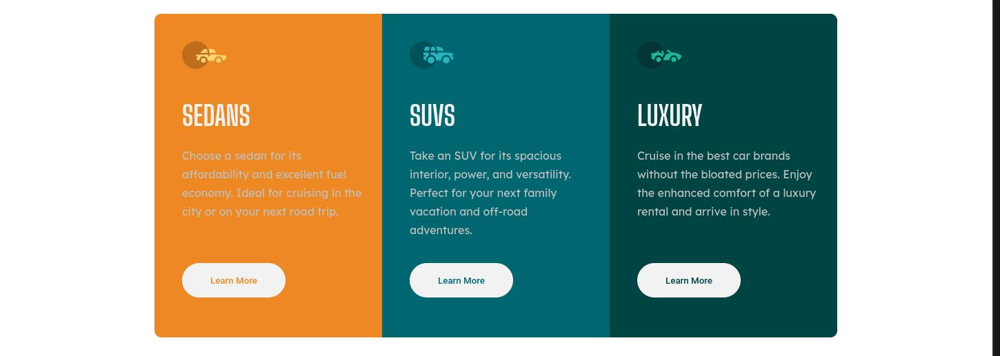

<h1>Frontend Mentor - 3-column preview card component</h1>

Olá, seja bem vindo a mais uma resolução de desafio. Desta vez, resolvi o [3-column preview card component challenge on Frontend Mentor](https://www.frontendmentor.io/challenges/3column-preview-card-component-pH92eAR2-). Sugestões e dicas são bem-vindas!

## Contéudo

- [Desafio](#desafio)
    - [Screenshot](#screenshot)
- [Meu processo](#meu-processo)
    - [Ferramentas](#ferramentas)
    - [O que eu aprendi](#aprendizado)
- [Guia de estilo](#estilo)

<a id="desafio">Desafio</a>

Foi proposto recriar o seguinte site, fazendo o mais semelhante possível, a partir de um guia de estilo fornecido.

<a id="screenshot">
<h2>Screenshot da minha solução:</h2>
</a>

<a id="meu-processo">
<h2>Processo de desenvolvimento:</h2>
</a>

<a id="ferramentas">
<h3>Ferramentas:</h3>
</a>

- [Adobe Color](https://color.adobe.com/pt/create/color-wheel)
- [Arquitetura BEM](https://en.bem.info/methodology/css/)
- [Atom](https://atom.io/)
- [CSS3](https://developer.mozilla.org/pt-BR/docs/Web/CSS)
- [FireFox](https://www.mozilla.org/pt-BR/firefox/new/)
- [Google Fonts](https://fonts.google.com)
- [HTML5](https://developer.mozilla.org/pt-BR/docs/Web/HTML)
- [JavaScript](https://developer.mozilla.org/pt-BR/docs/Web/JavaScript)
- [Mobile-first](https://developer.mozilla.org/en-US/docs/Glossary/Mobile_First)
- [SASS](https://sass-lang.com/)

<a id="aprendizado">
<h3>O que eu aprendi:</h3>
</a>

- Arquitetura BEM
- Padronização do CSS
- Posicionamento dos elementos
- SASS

<a id="estilo">
<h1>Guia de estilo</h1>
</a>

<h2> Layout </h2>

- Mobile: 360px
- Desktop: 1440px

<h2> Cores </h2>

<h3>Primárias</h3>

- Bright orange: hsl(31, 77%, 52%)
- Dark cyan: hsl(184, 100%, 22%)
- Very dark cyan: hsl(179, 100%, 13%)

<h3> Neutras </h3>

- Transparent white (paragraphs): hsla(0, 0%, 100%, 0.75)
- Very light gray (background, headings, buttons): hsl(0, 0%, 95%)

<h2> Tipografia </h2>

<h3> Body </h3>
- Font size: 15px

<h3> Fonte </h3>

- Family: [Lexend Deca](https://fonts.google.com/specimen/Lexend+Deca)
    - Weights: 400

- Family: [Big Shoulders Display](https://fonts.google.com/specimen/Big+Shoulders+Display)
    - Weights: 700

