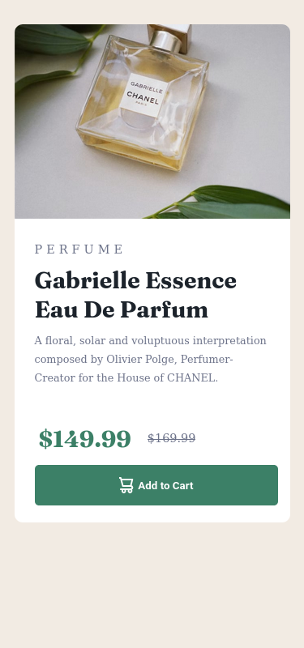
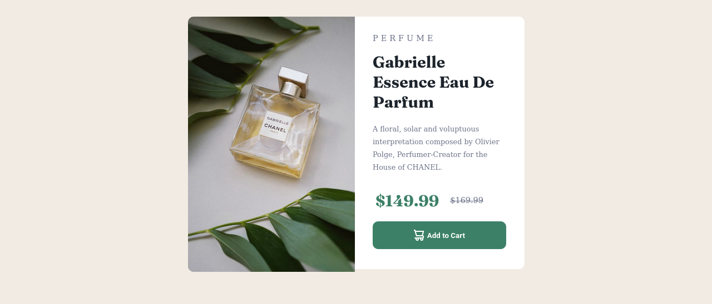

# Frontend Mentor - Product preview card component

Olá, seja bem-vindo. Gostaria de apresentar a você a solução para o desafio [link](https://www.frontendmentor.io/challenges/faq-accordion-card-XlyjD0Oam).

## Contéudo

- [Desafio](#desafio)
    - [Screenshot](#screenshot)
    - [Demo](#demo)
- [Meu processo](#meu-processo)
    - [Ferramentas](#ferramentas)
    - [O que eu aprendi](#o-que-eu-aprendi)
- [Referencias](#referencia)

## Desafio
Foi proposto recriar o seguinte site, fazendo o mais semelhante possível, a partir de um guia de estilo fornecido.

## Screenshot da minha solução:

### Mobile

### Desktop:

## Demo da minha solução:

- [Solução do desafio Product Preview Card Component](https://brunosilvafaria.github.io/Product-preview-card-component/).

## Processo de desenvolvimento:
- Primeiro: analisar o layout e definir um [Guia de estilo](style-guide)
- Segundo: o desenvolvimento foca na metodologia de mobile-first.
- Terceiro: criar a estrutura semântica do HTML e adicionar classes para estilização.
- Quarto: criação de uma [Paleta de Cores](https://color.adobe.com/pt/mythemes).
- Quinto: criar o estilo para mobile, desktop e para diferentes estados - hover.
- Por fim, é necessário revisar.

### Ferramentas

- HTML5
- CSS3
- Arquitetura BEM
- Mobile-first
- [Google Fonts](https://fonts.google.com)
- [Atom](https://atom.io/) - Editor de texto
- [Adobe Color](https://color.adobe.com/pt/create/color-wheel) - Paleta de cores
- [FireFox](https://www.mozilla.org/pt-BR/firefox/new/) - Navegador utilizado para visualização e desenvolvimento do site

### O que eu aprendi:
- Imagens responsivas;
- Utilização de fontes;
- Criação de padrão de estilo;
- Design responsivo;
- Quebra de texto automático.

## Referencias
- [Picture](https://www.w3schools.com/tags/tag_picture.asp)
- [Word-wrap](https://tecnoguia.istocks.club/como-quebrar-o-texto-em-uma-nova-linha-em-css/2021-03-30/)
