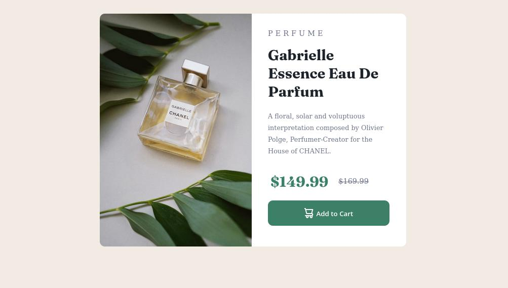
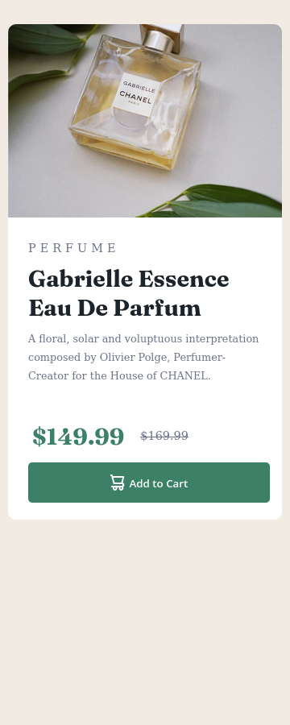

<h1>Frontend Mentor - Product preview card component</h1>

Olá, seja bem vindo a mais uma resolução de desafio. Desta vez, resolvi o [Frontend Mentor - Product preview card component](). Sugestões e dicas são bem-vindas!

<h2>Contéudo </h2>

- [Desafio](#desafio)
  - [Screenshot](#screenshot)
- [Meu processo](#meu-processo) 
- [Ferramentas](#ferramentas) 
- [O que eu aprendi](#aprendizado) 
- [Referências](#referencia) 
- [Guia de estilo](#estilo)

<a id="desafio">
    <h2>
    Desafio
    </h2>
</a>
Foi proposto recriar o seguinte site, fazendo o mais semelhante possível, a partir de um guia de estilo fornecido.

<a id="screenshot">
<h2> Screenshot da minha solução:</h2>
</a>

<a id="meu-processo">
<h2> Processo de desenvolvimento:</h2>
</a>

<a id="ferramentas">
<h3>Ferramentas</h3>
</a>

- [Adobe Color](https://color.adobe.com/pt/create/color-wheel)
- [Arquitetura BEM](https://en.bem.info/methodology/css/)
- [Atom](https://atom.io/)
- [CSS3](https://developer.mozilla.org/pt-BR/docs/Web/CSS)
- [FireFox](https://www.mozilla.org/pt-BR/firefox/new/)
- [Font Awesome](https://fontawesome.com)
- [Google Fonts](https://fonts.google.com)
- [HTML5](https://developer.mozilla.org/pt-BR/docs/Web/HTML)
- [Mobile-first](https://developer.mozilla.org/en-US/docs/Glossary/Mobile_First)

<a id="aprendizado">
<h3> O que eu aprendi:</h3>
</a>

- Arquitetura BEM
- Criação de padrão de estilo;
- Design responsivo;
- Imagens responsivas;
- Padronização do CSS
- Posicionamento dos elementos
- Quebra de texto automático.
- Utilização de fontes;

<a href="" id="referencia">
    <h3>Referencias</h3>
</a>

- [Picture](https://www.w3schools.com/tags/tag_picture.asp)
- [Word-wrap](https://tecnoguia.istocks.club/como-quebrar-o-texto-em-uma-nova-linha-em-css/2021-03-30/)

<a id="estilo">
<h1>Guia de estilo</h1>
</a>

<h2> Layout </h2>

- Mobile: 360px
- Desktop: 1440px

<h2> Cores </h2>

<H3> Primárias </h3>

- #3c8067
- #f2ebe3

<h3> Neutras </h3>

- #1c232b
- #6c7289
- #ffffff
- #1a4031

<h2> Tipografia </h2>

<h3> Body </h3>

- Titulo: 20px
- Paragrafo: 16px;
- Subtitulo: 18px;
- Subtitulo menor destaque: 14px;
- Botão: 16px;

<h3> Fonte </h3>

- Family: [Montserrat](https://fonts.google.com/specimen/Montserrat)
    - Weights: 500, 700

- Family: [Fraunces](https://fonts.google.com/specimen/Fraunces)
    - Weights: 700
