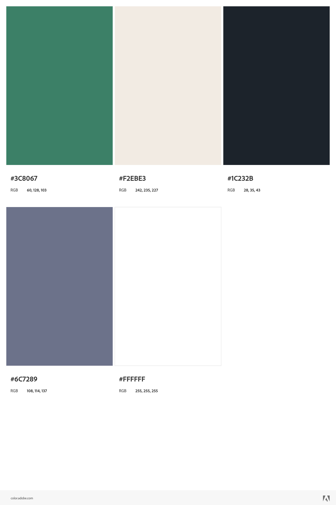

# Front-end Guia de Estilo

## Layout

O Design segue os seguintes tamanhos:

- Mobile: 375px
- Desktop: 1440px

## Cores

### Primarias

- #3c8067
- #f2ebe3

### Neutras

- #1c232b
- #6c7289
- #ffffff
- #1a4031

## Tipografia

### Body Copy

- Titulo: 20px
- Paragrafo: 16px;
- Subtitulo: 18px;
- Subtitulo menor destaque: 14px;
- Botão: 16px;

### Font

- Family: [Montserrat](https://fonts.google.com/specimen/Montserrat)
    - Weights: 500, 700

- Family: [Fraunces](https://fonts.google.com/specimen/Fraunces)
    - Weights: 700
